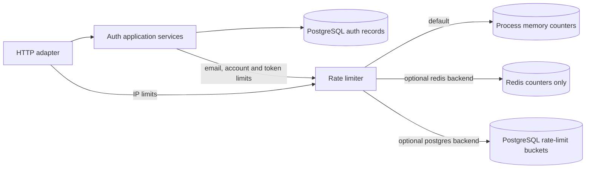

# Storage and caching

**There is no application data or HTTP response cache in this template.** Redis is an optional store for *rate-limit counters*, not a cache for users, access tokens, refresh tokens, sessions, or database queries. Starting Redis via `docker compose up -d db redis` does not enable the Redis backend; `RATE_LIMIT_BACKEND` defaults to `memory`.

Only one rate-limit backend is selected at a time. Neither Redis nor the in-process counter store sits between the application and its PostgreSQL auth records.

| Data | Where it lives |
| --- | --- |
| Users, password hashes, email-verification/password-reset records, refresh-token digests and rotation state | PostgreSQL |
| Rate-limit counters | In-process memory (default), Redis (`RATE_LIMIT_BACKEND=redis`), or PostgreSQL (`RATE_LIMIT_BACKEND=postgres`) |
| JWT access tokens | Signed and sent to clients; validated from their signature and expiry, not looked up in Redis |
| OAuth session cookie | Signed cookie handled by the OAuth adapter, not stored in Redis |

Redis rate-limit keys hold a counter with a TTL for one policy window. Keys are HMAC digests, not raw IPs, emails, or tokens. Redis persistence, eviction settings, and availability are operational choices: if counters are lost they start over, and if the selected backend cannot be reached, authentication requests subject to its checks fail closed with HTTP 503. The template does not cache PostgreSQL results or use Redis pub/sub, a job queue, or session storage.

Add a data cache only for a measured need, with an explicit expiry/invalidation strategy. Avoid caching security-sensitive authentication state without handling revocation and consistency first. See [Rate limiting](rate-limiting.md) for backend setup and failure behavior.
